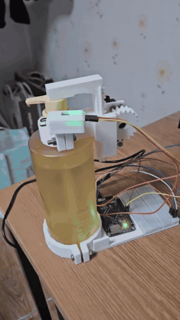
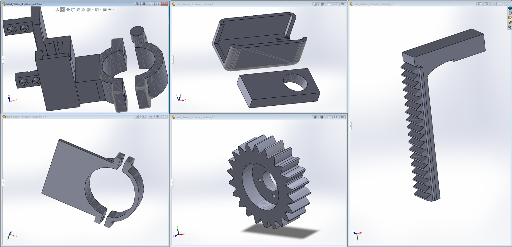
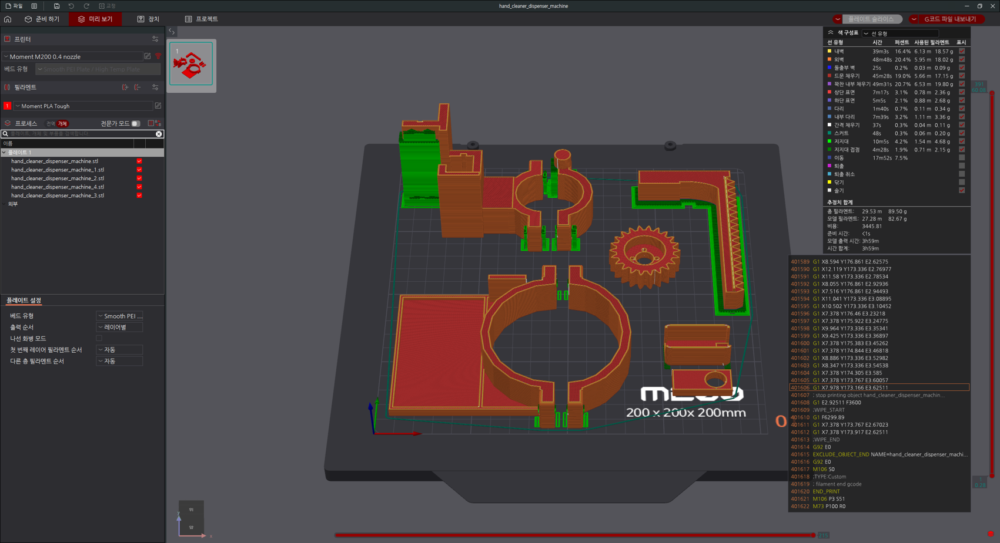

# 🧴 STM32 Auto Hand Sanitizer Dispenser

STM32H743 기반으로 IR 센서를 이용해 손을 감지하고, PWM으로 서보모터를 제어하여 손세정제를 자동으로 누르고 복귀시키는 임베디드 시스템 프로젝트입니다.

펌웨어 구현뿐 아니라 실제 세정제 용기에 장착할 수 있도록 기어·랙 기반 기구부를 3D CAD로 설계하고, 3D 프린팅 후 조립하여 실제 동작을 검증했습니다.

## 🎥 Demo

<p align="center">
  
</p>

## 🛠 Tech Stack

- **MCU**: STM32H743VIT6
- **Firmware**: C, STM32 HAL, STM32CubeMX / STM32CubeIDE
- **Control**: GPIO Input, Timer/PWM
- **Hardware**: IR Sensor, MG995 Servo Motor
- **Mechanical Design**: 3D CAD Modeling, Gear & Rack Mechanism, 3D Printing

## ⚙️ System Operation

1. IR 센서가 손을 감지합니다.
2. STM32가 TIM3 CH1 PWM 신호로 서보모터를 구동합니다.
3. 기어·랙 구조가 세정제 펌프를 눌러 1회 분사합니다.
4. 서보모터가 반대 방향으로 구동되어 기구부가 원위치로 복귀합니다.
5. 손이 계속 감지되는 동안 추가 분사를 막고, 손이 빠진 뒤 다시 감지될 때 다음 동작을 수행합니다.

## 🔧 Firmware Configuration

| Item | Configuration |
| --- | --- |
| MCU | STM32H743VIT6 |
| IR Sensor | PC5, GPIO Input + Pull-up, Active-Low |
| Servo PWM | PA6, TIM3_CH1 |
| Timer Prescaler | 63 |
| Timer Period | 19999 |
| PWM Frequency | 50 Hz |
| Stop Pulse | 1500 μs |
| Push Pulse | 2000 μs |
| Return Pulse | 1000 μs |
| Push Time | 350 ms |
| Return Time | 250 ms |

## 🧩 Mechanical Design

3D CAD를 이용해 세정제 용기 고정부, 기어, 랙 및 누름 구조를 설계했습니다.



설계한 부품은 3D 프린팅을 위해 슬라이싱 및 출력 배치를 진행했습니다.



## 💻 Firmware Logic

핵심 제어 흐름은 다음과 같습니다.

```text
IR Sensor Detection
        ↓
Servo Push
        ↓
Dispense
        ↓
Servo Return
        ↓
Stop
        ↓
Wait Until Hand Is Removed
```

반복 분사를 방지하기 위해 손이 감지된 상태에서는 한 번만 동작한 뒤, 센서 입력이 해제될 때까지 정지 상태를 유지합니다.

## 📌 Project Type

- University Course Project
- Embedded System / Mechanical Design
